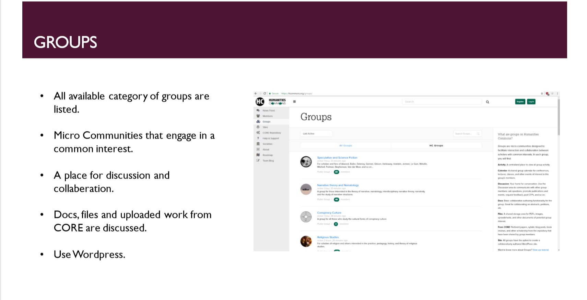

# IASC 2P02 | Rebecca Cross 

# Bio 

I am a student at Brock University, currently in my second year. I am studying in the Digital Humanities field, I hope to specialize in cultural studies. How technology affects us as a society and what will the cultural impacts be by relying heavily on technology in our everyday lives. 
My recent projects reflected my ability to investigate a topic and come to an opinion with academic evidence. In my Academic Blog project, I focused on “Humanity and Graphical Data Display” and how it can be easily misinterpreted by Humans. I studied Drucker"s arguments heavily to draw my own conclusion on the issue. To test this argument I used a digital graph tool to create my own visual graph with shapes and colors. Pursuing cultural studies relies heavily on these skills. Understanding historical foundations are crucial to understanding wider systems of power that directly affect political and social issues. I will continue this study to grasp how we create class structures, social ideologies and how generations evolve. My work will focus on historical events and how they continue to affect our society. My work would be published online as academic articles. My future work will always be opened sourced and available to all who love to learn.
 

## Feature Project: [Academic Blog]

This academic blog is the featured project of this portfolio. It focuses on the use of visual data used in society. The cons and pros are weighed against each other, both every day and academic examples are used. Visual data is heavily misinterpreted in the academic field as well as media platforms. This falls onto the digital humanities to fix this false illusion of data because it is of malpractice and has no place in the future of technology. Druckers arguments are heavily focused in this blog, her findings are simply that visual data is easily misinterpreted by humans because of the popular shapes and colours that are used. There is a time and place for visual representation such as in advertisements and posters. But not for critical information used in News outlets. A new way of explaining information should be used, it must be as accurate as possible. The digital humanities are must be tasked with changing this way of presenting data and finding a solution that everyone can understand. This problem is significant because of how little it is questioned. The vast majority of humans agree that charts and graphs are true representations of data, without a second thought. It is accepted and utilized in all fields of study such as mathematics, science and business. The only field to question it is the digital humanities. A field that is dedicated to theories and critical thinking of this digital age, where for the first time in history humans and technology meet.

Based on the instructor feedback, there were a lot of revisions to be made on this blog post. Building upon the strengths and focusing more on how visualizations affect everyday life, in apps and news outlets. As well as how symbols have evolved drastically into emoji’s and icons that are accepted world wide. Giving numerous specific examples to support the overall arguments. This is the commit link to those added examples  https://github.com/rc16je/IASC-2P02/commit/65da1642291ced90df8f81a573a44880a17ba416#diff-e95c7dc8eefee7d0e25121cd7f0007ae . as well as the voyant-tool. It focused on a brief summary of “harry potter and the philosopher's stone”. Another example of this term map was added to the blog in this commit link https://github.com/rc16je/IASC-2P02/commit/2d0efe2d2da2257ef8e77e6d0ad958f840d10fb2#diff-e95c7dc8eefee7d0e25121cd7f0007ae . To make sure the structure of the post was fluent in this commit link https://github.com/rc16je/IASC-2P02/commit/aaefaca279b4c769ff0b8884726b6a75d3093fba#diff-e95c7dc8eefee7d0e25121cd7f0007ae  paragraphs were moved and photos were rearranged as well.  A technical requirement that was revised is the visible commit on github labeled “publishing commit”. Prior to this revision, I had no idea how to find the commit link on github. But now I feel that I have a stronger understanding of the platform and can use it for my personal projects and for any jobs I chose to pursue.

Reading what Drucker was arguing, I found it difficult at first to connect with everyday scenarios. While revising my work, new ideas and examples came flooding in because of the voyant-tool I used. The term map reminded me of the school ads I used to see in Highschool for “why it’s important to pursue math”. With research I found the same posters I grew up staring at in classrooms. My understanding of Druckers arguments connected me to everyday life examples that I was missing in my original blog post.      
 

read <a href="https://rc16je.github.io/IASC-2P02/blog">Revised Academic Blog</a>

## Collaborative Project

Team Two focused on the Humanities Commons, a website in the format of a blog. It was created using WordPress. A very popular blog platform. The idea behind the humanities commons is open access information, free to read and study from. Only accounts verified by the website are allowed to upload articles and express their opinions. The work published can never be re-published anywhere else for profit even if it is being published by the owner/author. This website has thousands of users that share their work and knowledge. Scholars in the digital humanities use this site as a way communication. Their theories are all protected by the website under their copyright.

As a group we used all of the given lab time and work periods in lecture to discuss our roles. I contributed to the group by focusing on some of the main features the humanities commons offer. I made 3 slides with screenshot images of the website and wrote the point. One of the slides “Core Repository” didn’t explain the full feature of the CORE, so a second slide was added by my group member. My CORE slide is below. 

We collaborated on the CORE feature because it has a lot to offer, it is a digital library that holds all the academic work and articles that are on the humanities commons as well as the legal implications of uploading academic work. The CORE is the main feature of the website, so we found it suiting to split the research of this feature in half. I presented on the Sites and Group slide. These slides are below.

I worked closely with my group during class time, overall in the digital humanities field collaboration is key to moving forward and producing great projects. Working as a team in this project was easy because we had class time to talk and work out the individual jobs of each group member. Collaboration between class members allows us to grow and gain a deeper understanding of topics discussed in class. Large class discussions can sometimes be overwhelming for most students, concentrated groups allows for individuals to feel more comfortable and more involved in the discussions.  

Lastly I uploaded the group powerpoint to our repository in github under “Overview”. Link to commit https://github.com/IascAtBrock/IASC-2P02-TeamPresentations/commit/7729507fcc45eed89ab7ab94dc488f6c1e4808f6#diff-5016e17fff418d6a55f3b3e410e44e7f 	

## Research Presentation

<a href="https://rc16je.github.io/IASC-2P02/reveal/">Stereoscopes-Pecha Kucha</a>

## Academic Blog

<a href="https://rc16je.github.io/IASC-2P02/blog">Revised Academic Blog</a>

