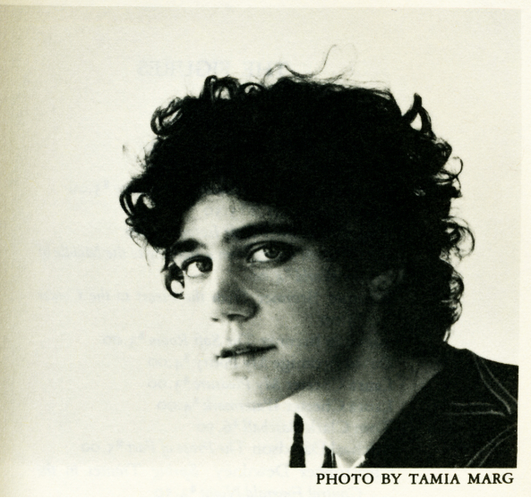

# IASC 2P02 | Rebecca Cross 

# Bio 

I am a second year student at Brock University, taking Interactive Arts and Science a four year program. In the digital humanities field, studying complex theories and applying them to my everyday life. 

## Feature Project: [Title of project here]

Here are 250 words introducing this work.

Here is my 250 word statment describing how this research evolved over time. I made these changes, which u can see [here] (....)
I also made these changes, which you can see [here] (...) I also made these changes, which you can see here [here]. 
Overall these changes show x and y changes in my thinking. 

read [title goes here](readme) 

## Collaborative Project

here is my 100 word project description 

here is my 250 word collaboration statment. I approach collaboration in x ways, which is reflected in y work (available [here] (...) I also approach collaboration in a ways, which is reflected in b work (available [here] (...) I also contributed x assets to my team, seen below. 

## Research Presentation

[Title goes here]

## Academic Blog

[Title goes here]

