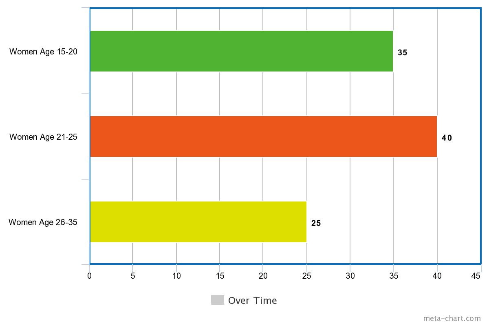

# Humanities and Graphical Data Display

This blog is about “Humanity and Graphical Data Display”, we will look at arguments made by Johanna Drucker in her scholarly writing “Humanities Approaches to Graphical Display”. She is the Martin and Bernard Breslauer Professor in the Department of Information Studies at the Graduate School of Education and Information Studies at UCLA. And her work focuses on visual language, letterforms, typography, digital aesthetics and much more. 

It is noticeable that the world we live in relies heavily on visual representations of data, it could be as simple as the weather forecast showing a tiny cloud image with a bright yellow sun poking its head from behind. This is universally explained as a sunny day with clouds, there is no specifics on how cloudy it will be and in which areas of the city will be less cloudy. It is simply a representation of how images displayed can give information but not as accurately as possible. Because our society has become so accustomed to this method of representation, no one is quick to ask “but how cloudy?”. Of course there is more data explained in numbers and degrees under the small cloud and sun. But it is also true that many people trust the illustration of sunshine with slight clouds as good weather without checking to see if there is high chances of rain later on in the evening. This is a small example of misleading representation of data, but it does point to society's dependence on visualization. 

Drucker argues that “such graphical tools are a kind of intellectual Trojan horse, a vehicle through which assumptions about what constitutes information swarm with potent force." She speaks of graphical data that is show in a visual graph or chart. Often times these visual representations do not always include other important variables that could potentially affect the data being shown as true. Drucker’s example of this is she uses a bar chart to compare the percentage of men and women in various national populations at a present time. She states that there are immediate issues, one so simple as “what counts as a nation?”, “Are transient and immigrant populations documented?” and “What kind of time span counts as at the present time within which these populations are counted?”. Lastly she argues that gender definition is a highly debated topic and cannot be simply distinguished between man and women. Using a bar chart is inaccurate and deceptive. 
	
The debates in the digital humanities moment edition 2012 states “At stake in the rise of the digital humanities is not only the viability of new research methods (such as algorithmic approaches to large humanities data sets) or new pedagogical activities (such as the incorporation of geospatial data into classroom projects) but also key elements of the larger academic ecosystem that supports such work.” The humanities core belief is in the concept of knowledge as interpretation, the physical, social and cultural world is not self-evident or self-identical and nothing is mere fact. Everything is open to individual interpretation, so it is of extreme importance that graphical displays are pushed with more theoretical insight and critical thought before blindly accepting this as a sole truth of the presented data. It is morally wrong to display a misleading chart and or graph based on data. 

In this digital age, media dominates the urban world, everything has taken a visual form to suit these media platforms. There are icons called emoji’s that represent everything from humans working out at the gym, to a kissy face. This idea of having a world wide accepted interpretation of symbols, icons and sounds have transformed the way humans communicate. The need for quick knowledge has lead to this vast visualization of data. There is very little reading involved in everyday life. For example if a person opens any app on their smartphone what they will see is a small loading wheel. That person automatically understands that the app is loading. Five years ago it would have said “Loading…”, something this simple has been cut out and replaced with a visual wheel. The entire world, without question accepted this as the loading symbol.  Symbols, icons and emoji’s are visual interpretations and they are everywhere. In every media platform available these interpretations dominate our communication. It is true that humans can understand information faster when it’s visual. But not all data can be made in a visual sense. This is what Drucker argued. Outside of the academic world, this consistent use of visual data is used in all parts of media. For example News outlets used these visual methods in their charts and polls while talking about the 2016 Presidential election in the United States. By showing two bars of opposite colours without a firm numerical value can misrepresent the reality of the presidential race. This misrepresentation can reflect the News outlets political views and push their agenda. By misrepresenting their opposing party. 

A more extreme example is if CNN had a news story of women abuse and used a bar chart to represent the number of women abused over time. It would be morally wrong to mislead the general public to believe that 10,000 women are being abused in their area. If the bar chart never specifically stated when and to what point did they being collecting data and stopped. Or even if the data collected was based on a small city, country or around the world. And lastly how the data was collected? By anonymous survey or by police reports, then new variables come into play. Did everyone answer the survey truthfully, did everyone women in the data collecting area fill out this survey? Or if the data was collected by police reports, how many women have not come forward to report abuse. Then the bar chart would conclude only 10,000 which in reality could be much more. 

Charts and graphs aren’t the only way data is visually presented, a popular method is a group of words in a variation of sizes and colours. This method can be created by using Voyant-Tools. The example below uses a short summary of “Harry Potter and the Philosopher’s Stone” to create a term map. The larger the word, the more it was used in the summary. The largest words are “harry”, “hogwarts”, “learns”, “world”, “school” and “quickly”. To find out how many times these terms were used a person must hover over the words. The smallest words were used once or twice. For a person that has never read or watched Harry Potter this term map would look incredibly confusing and the chosen words would have little to no connection with each other. This visual summary means nothing unless the person has prior knowledge of the text. This way of organizing terms in a text has become quite popular, especially in advertisements of education. The example below shows the word “education” and the words surrounding it are related terms. This group of words represent “education” and the system it follows. There are both positive words like “justice”, “development” and “learning” but there are also negative ones such as “oppression”, “systems” and “privileged”. These terms are heavily used to explain the system of education. These charts can be extremely useful in targeting key ideas just like the education example, but misused or overused will result in a chart with little meaning.  

<iframe style='width: 637px; height: 480px;' src='//voyant-tools.org/tool/Cirrus/?visible=65&corpus=27b2fcd18269cbe6ee30f06ee83c6e00'></iframe>

Charts that use geometric forms are misleading and cannot show the full amount of data there is. Lines, bars and pies are the most common shapes for charts and diagrams because it is easy for people to understand data. Data shown in numbers are only understandable to the people that know what that data represents (in some cases the lower the number the better, is based on prior knowledge i.e ping should be low) , so it is no surprise that data has taken a visual form in pie charts and columns for easier understanding.  All of these ways of visualizing data has come from fields outside of digital humanities, we base our data representation on other systems without thinking of the implications of our data being misrepresented. Drucker states "To intervene in this ideological system, humanists, and the values they embrace and enact, must counter with conceptual tools that demonstrate humanities principles in their operation, execution, and display. The digital humanities can no longer afford to take its tools and methods from disciplines whose fundamental epistemological assumptions are at odds with humanistic method." It is in our best interest to pull away from this norm of visualization and create a new way of looking at data based on our own principles and values in the digital humanities.

# Work Cited

Drucker, Johanna. “Humanities Approaches to Graphical Display” digitalhumanities.org, 2011, http://www.digitalhumanities.org/dhq/vol/5/1/000091/000091.html 

Gold, Matthew K. “The digital humanities moment.” Debates in the Digital Humanities, 9 January 2012, http://dhdebates.gc.cuny.edu/debates/1  

Tool used https://www.meta-chart.com/bar#/display to create the women abuse bar chart example. 

